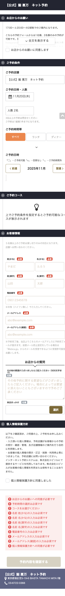
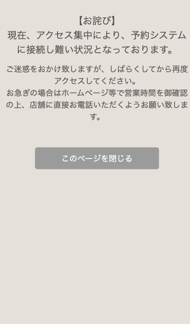
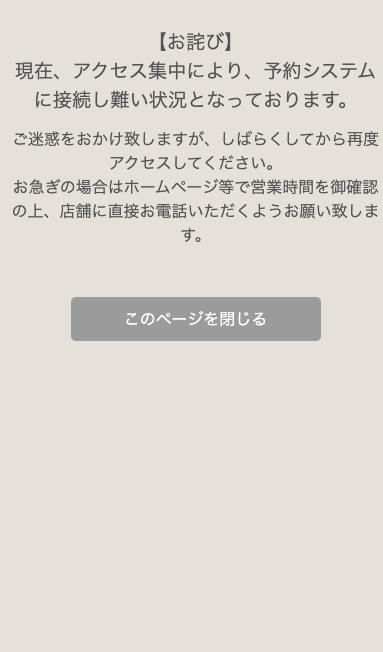
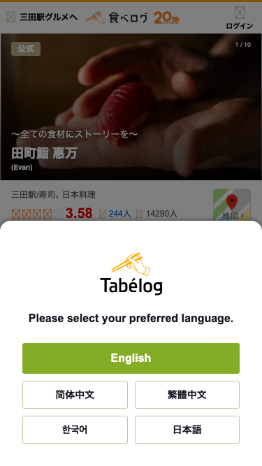

# Googlebot Crawler

A tool to simulate Googlebot behavior for website testing and accessibility checks.

## Installation

```bash
yarn install
```

## Usage
Clean and run:
```bash
rm -rf screenshots-* && node crawl.js
```

## What it does
- Simulates Googlebot user agent
- Tests with normal IP and Google IP
- Takes screenshots for evidence
- Monitors redirects and JavaScript errors
- Saves results to `screenshots` folder

## Test Results

### Booking.com Test Results (https://booking.ebica.jp/)

| Test Scenario | Description | IP Address | Screenshot |
|--------------|-------------|------------|------------|
| Normal IP | Complete browser simulation with normal IP | No specific IP |  |
| Primary Googlebot | Primary Googlebot IP | 66.249.79.142 |  |
| Googlebot Crawler | Google crawler IP range 66.249.64.0/19 | 66.249.65.100 |  |
| Google Mobile Crawler | Google Mobile crawler IP | 216.58.197.46 |  |

### Tabelog Test Results (https://tabelog.com/tokyo/)

| Test Scenario | Description | IP Address | Screenshot |
|--------------|-------------|------------|------------|
| Normal IP | Complete browser simulation with normal IP | No specific IP |  |
| Primary Googlebot | Primary Googlebot IP | 66.249.79.142 |  |
| Googlebot Crawler | Google crawler IP range 66.249.64.0/19 | 66.249.65.100 |  |
| Google Mobile Crawler | Google Mobile crawler IP | 216.58.197.46 |  |

## Analysis

These screenshots demonstrate how different websites respond to various Googlebot user agents and IP addresses. Compare the visual differences between:
- **Normal IP access**: How the site appears to regular users
- **Googlebot IPs**: How the site responds when accessed from verified Google crawler IP addresses

This helps identify any cloaking, redirects, or different content delivery based on the user agent or IP address.
